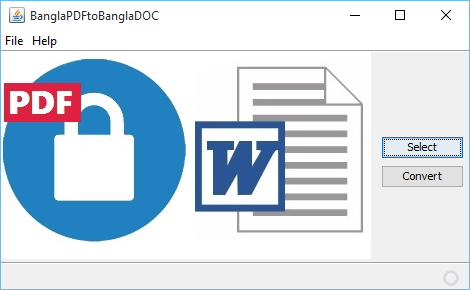
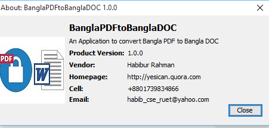

# BanglaPDFtoBanglaDOC

```
This Project is done for my Undergraduate project work under supervised Prof. Dr. Nazrul Islam Mandal, Head Dept. of CSE, RUET.
```
 This project actually converts Bangla PDF to Bangla DOC. The PDF should be in ASCII font format. 

## Downloads

* [Link](https://github.com/habibruetian12/BanglaPDFtoBanglaDOC/releases/download/1.0.0/BP2BD.jar)

## Screenshots




### TODO

* Add Image Parsing
* Add Unicode to ASCII converter
* Add feature for Password Protected PDF
* Add more User Friendly GUI
