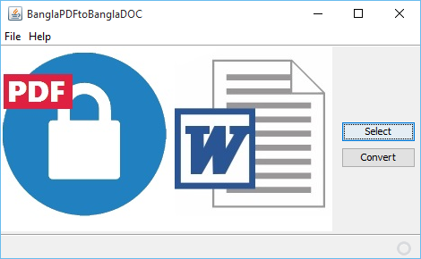
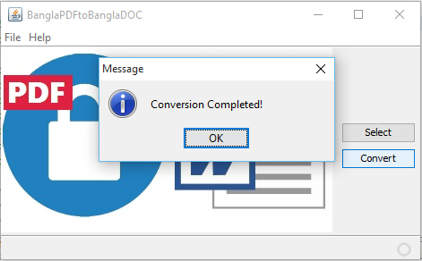
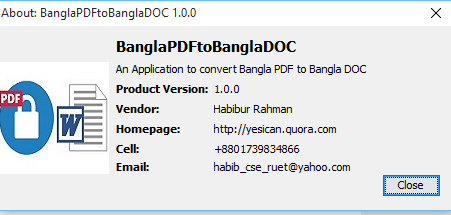

# BanglaPDFtoBanglaDOC

```
This Project is done for my Undergraduate project work under supervised 
Prof. Dr. Nazrul Islam Mandal, 
Head Dept. of CSE, 
RUET, Rajshahi, Bangladesh.
```
 This project actually converts Bangla PDF to Bangla DOC. The PDF should be in ASCII font format. 

## Downloads

* [Link](https://github.com/habibruetian12/BanglaPDFtoBanglaDOC/releases/download/1.0.1/BP2BD.jar)

## Screenshots




## TODO

* Add Image Parsing
* Add Unicode to ASCII converter
* Add feature for Password Protected PDF
* Add more User Friendly GUI

## Credits

* [Apache PDFBox | A Java PDF Library] (https://pdfbox.apache.org/) 

## License
``` 
    BanglaPDFtoBanglaDOC is a software to  convert Bangla PDF to Bangla DOC.
    Copyright (C) 2016  Habibur Rahman

    This program is free software: you can redistribute it and/or modify
    it under the terms of the GNU General Public License as published by
    the Free Software Foundation, either version 3 of the License, or
    (at your option) any later version.

    This program is distributed in the hope that it will be useful,
    but WITHOUT ANY WARRANTY; without even the implied warranty of
    MERCHANTABILITY or FITNESS FOR A PARTICULAR PURPOSE.  See the
    GNU General Public License for more details.

    You should have received a copy of the GNU General Public License
    along with this program.  If not, see <http://www.gnu.org/licenses/>.
 ```
